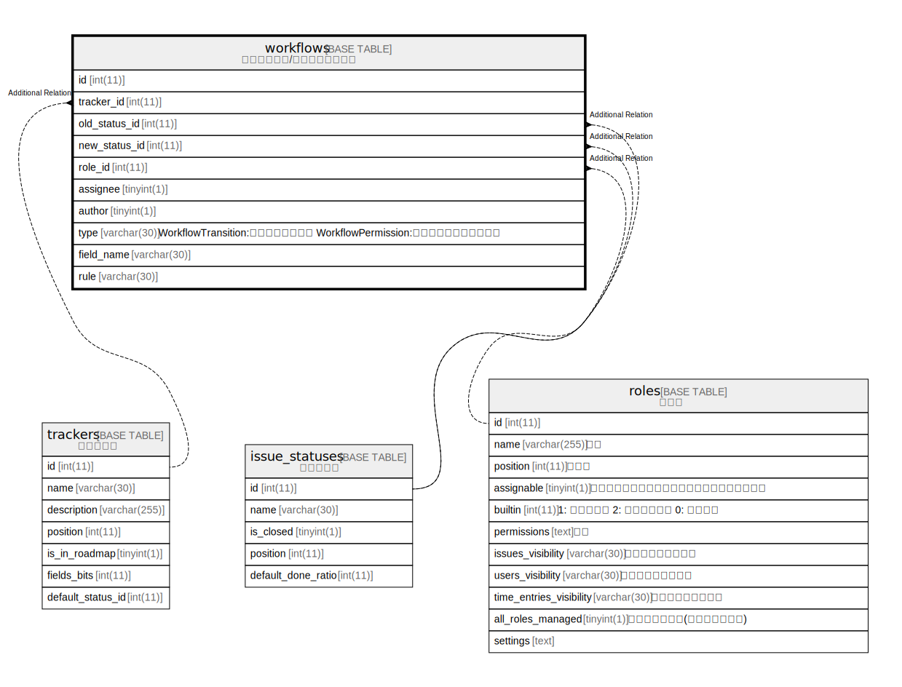

# workflows

## 概要

ワークフロー

<details>
<summary><strong>テーブル定義</strong></summary>

```sql
CREATE TABLE `workflows` (
  `id` int(11) NOT NULL AUTO_INCREMENT,
  `tracker_id` int(11) NOT NULL DEFAULT 0,
  `old_status_id` int(11) NOT NULL DEFAULT 0,
  `new_status_id` int(11) NOT NULL DEFAULT 0,
  `role_id` int(11) NOT NULL DEFAULT 0,
  `assignee` tinyint(1) NOT NULL DEFAULT 0,
  `author` tinyint(1) NOT NULL DEFAULT 0,
  `type` varchar(30) DEFAULT NULL,
  `field_name` varchar(30) DEFAULT NULL,
  `rule` varchar(30) DEFAULT NULL,
  PRIMARY KEY (`id`),
  KEY `wkfs_role_tracker_old_status` (`role_id`,`tracker_id`,`old_status_id`),
  KEY `index_workflows_on_old_status_id` (`old_status_id`),
  KEY `index_workflows_on_role_id` (`role_id`),
  KEY `index_workflows_on_new_status_id` (`new_status_id`),
  KEY `index_workflows_on_tracker_id` (`tracker_id`)
) ENGINE=InnoDB DEFAULT CHARSET=utf8mb4
```

</details>

## ラベル

`単一テーブル継承`

## カラム一覧

| 名前            | タイプ         | デフォルト値       | NULL許可   | Extra Definition | 子テーブル      | 親テーブル                               | コメント                                                                                     |
| ------------- | ----------- | ------------ | -------- | ---------------- | ---------- | ----------------------------------- | ---------------------------------------------------------------------------------------- |
| id            | int(11)     |              | false    | auto_increment   |            |                                     |                                                                                          |
| tracker_id    | int(11)     | 0            | false    |                  |            | [trackers](trackers.md)             |                                                                                          |
| old_status_id | int(11)     | 0            | false    |                  |            | [issue_statuses](issue_statuses.md) |                                                                                          |
| new_status_id | int(11)     | 0            | false    |                  |            | [issue_statuses](issue_statuses.md) |                                                                                          |
| role_id       | int(11)     | 0            | false    |                  |            | [roles](roles.md)                   |                                                                                          |
| assignee      | tinyint(1)  | 0            | false    |                  |            |                                     |                                                                                          |
| author        | tinyint(1)  | 0            | false    |                  |            |                                     |                                                                                          |
| type          | varchar(30) | NULL         | true     |                  |            |                                     | WorkflowTransition:ステータスの遷移<br>WorkflowPermission:フィールドに対する権限<br><br>                    |
| field_name    | varchar(30) | NULL         | true     |                  |            |                                     |                                                                                          |
| rule          | varchar(30) | NULL         | true     |                  |            |                                     |                                                                                          |

## 制約一覧

| 名前      | タイプ         | 定義               |
| ------- | ----------- | ---------------- |
| PRIMARY | PRIMARY KEY | PRIMARY KEY (id) |

## INDEX一覧

| 名前                               | 定義                                                                                |
| -------------------------------- | --------------------------------------------------------------------------------- |
| index_workflows_on_new_status_id | KEY index_workflows_on_new_status_id (new_status_id) USING BTREE                  |
| index_workflows_on_old_status_id | KEY index_workflows_on_old_status_id (old_status_id) USING BTREE                  |
| index_workflows_on_role_id       | KEY index_workflows_on_role_id (role_id) USING BTREE                              |
| index_workflows_on_tracker_id    | KEY index_workflows_on_tracker_id (tracker_id) USING BTREE                        |
| wkfs_role_tracker_old_status     | KEY wkfs_role_tracker_old_status (role_id, tracker_id, old_status_id) USING BTREE |
| PRIMARY                          | PRIMARY KEY (id) USING BTREE                                                      |

## ER図



---

> Generated by [tbls](https://github.com/k1LoW/tbls)
